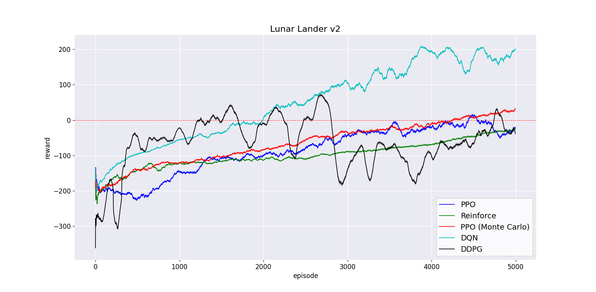

### Disclaimer:
This is a **work in progress repo**, there may be bugs in the code and numerous typos in the README file. The documentation for the methods and the class structure is a work in progress. The current is the third implementation of the repo, more algorithm (and implementation) can be found on the oldest versions (links below).

### TODO:
- Translate DDPG documentation.
- Fix PPO Monte Carlo 
- Implement TD3
- Implement SAC
- Benchmarki all the algorithms for baselines

# BasicRL
A basic implementation of the standard reinforcement learning algorithms in TensorFlow 2, designed for gym-like environments. The code is ready to train and provide an easy interface to change all the hyperparameters for the training.

## Available Algorithms
- [x] REINFORCE
- [x] Proximal Policy Optimization (PPO)
- [x] Proximal Policy Optimization Monte Carlo (mcPPO)
- [x] Double Deep Q-Learning (DDQN)
- [x] Deep Deterministic Policy Gradient (DDPG)
- [ ] Twin Delayed DDPG (TD3)
- [ ] Soft Actor-Critic (SAC)

## Run the Algorithms
To use our algorithms use the class **BasicRL** from the python file *basic_rl/main.py*. The object BasicRL require a key of the algorithm to run and the gym environment as input.
```
# VALID ALGORITHM KEYS: ["REINFORCE", "PPO", "mcPPO", "DQN", DDPG"]

from basic_rl.main import BasicRL

env = gym.make("CartPole-v1")
basic_rl = BasicRL( "PPO", env )
basic_rl.train()
```
BasicRL will automatically check if the selected algorithm is compatible with the type of environment (discrete or continuous). By default BasicRL will use the default parameters for the training. You can change all the parameter when create the BasicRL object as follow:
```
basic_rl = BasicRL( "PPO", env, verbose=1, gamma=0.84, memory_size=1000 )
basic_rl.train()
```
Follow a list of the available parameters (with the default value):
```
# Common to all the algorithms
verbose = 1 
gamma = 0.99  
memory_size = None (no limit)
layers = 2
nodes = 32

# Only DQN (DDQN)
epoch = 40
batch_size = 128

# Only Actor Critic Method (PPO, mcPPO, DDPG)
critic_epoch = 40
critic_batch_size = 128
layers_critic = 2
nodes_critic = 32

# Only Value Based (DDQN, DDPG)
eps_decay = 0.9995
tau = 0.005

# Only Policy Based (REINFORCE, PPO, mcPPO)
trajectory_update = 10
trajectory_mean = False

# Only Policy Based with Continuous control (PPO, mcPPO)
sigma_decay = 0.99999
```

When the paramter **verbose** is set to 2 the algorithm save the reward list inside the folder *data*. The documentation contains a definitions for all the other parameters.

## Example
The python script *example.py* contains an example to run cartpole v1 with PPO and save the results inside the folder data.

## Baseline
To reproduce our results on [Lunar Lander Continuous](https://gym.openai.com/envs/LunarLanderContinuous-v2/) and [Lunar Lander Discrete](https://gym.openai.com/envs/LunarLander-v2/) use the default hyperparameters. The folder *data/baselines/* contains the files with the reward obtained in our experiments (4 seed for each algorithm). To plot the results, modify and run the python script in:
```
python plotter/plot.py
```

### Discrete Baseline:


*NB: data are taken on 3 different run with seeds [2, 5 and 6]*

## Built With

* [Tensorflow](https://www.tensorflow.org/)
* [OpenAI Gym](https://gym.openai.com/)
* [Numpy](https://numpy.org/)
* [Matplot Lib](https://matplotlib.org/)

## Old Versions

- V1 ([Link](https://github.com/d-corsi/BasicRL/tree/81ad2699f763923b6d1f23d833e6a39ed90bfd8f)): *The first stable version of the code, easy to read and follow but not scalable*
- V2 ([Link](https://github.com/d-corsi/BasicRL/tree/cb2255dcfac2d640b561cb294583ff61cc6914ed)): *Second version with a refactored code, hard to read for different implementations*

## Author

* **Davide Corsi** - davide.corsi@univr.it

## License

- **MIT license**
- Copyright 2021 © **Davide Corsi**.
