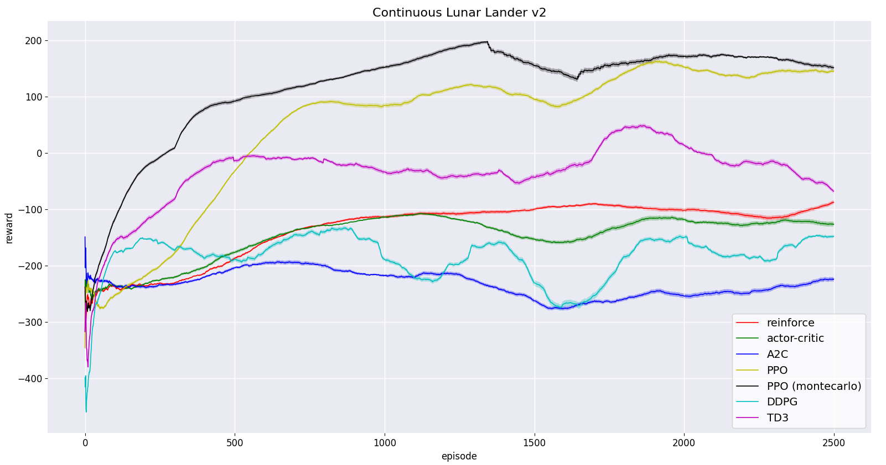
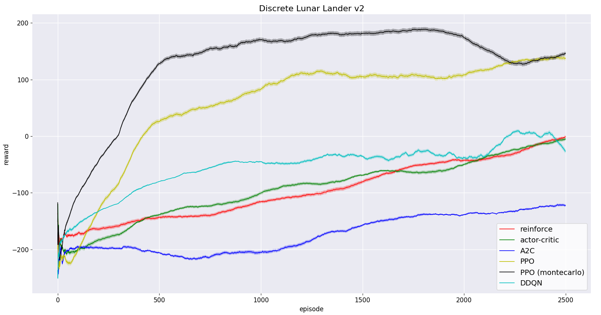

### Disclaimer:
This is a **work in progress repo**, there may be bugs in the code and numerous typos in the README file. The documentation for the methods and the class structure is a work in progress. For the class *basic_reinforcement.py* the code will be refactored.

# BasicRL
A basic implementation of the standard reinforcement learning algorithms in TensorFlow 2, designed for gym-like environments. The code is ready to train and provide an easy interface to change all the hyperparameters for the training.

## Available Algorithms
- [x] REINFORCE
- [x] Actor-Critic
- [x] Advantage Actor Critic (A2C)
- [x] Proximal Policy Optimization (PPO)
- [x] Montecarlo Proximal Policy Optimization (mcPPO)
- [x] Double Deep Q-Learning (DDQN)
- [ ] C51
- [x] Deep Deterministic Policy Gradient (DDPG)
- [ ] Soft Actor-Critic (SAC) 
- [x] Twin Delayed DDPG (TD3) 

## Run the Algorithms
To use our algorithms use the class **BasicRL** from the python file *basic_rl/basic_rl.py*. The object BasicRL require a key of the algorithm to run and the gym environment as input.
```
# VALID ALGORITHM KEYS: ["REINFORCE", "ActorCritic", "A2C", "PPO", "mcPPO", "DDPG", "DQN", "TD3"]

from basic_rl.basic_rl import BasicRL

env = gym.make("CartPole-v1")
basic_rl = BasicRL( "PPO", env )
basic_rl.train()
```
BasicRL will automatically check if the selected algorithm is compatible with the type of environment (discrete or continuous). By default BasicRL will use the default parameters for the training. You can change all the parameter when create the BasicRL object as follow:
```
basic_rl = BasicRL( "PPO", env, verbose=1, gamma=0.84, memory_size=1000 )
basic_rl.train()
```
Follow a list of the available parameters (with the default value):
```
# Common to all the algorithms
verbose = 1 
gamma = 0.99  
update_frequency = 10
batch_size = 64
epoch = 10
memory_size = None (no limit)

# Only Continuous REINFORCE, Actor/Critic, A2C and PPO
sigma = 1.0
sigma_decay = 0.99

# Only DQN, DDPG and TD3
exploration_rate = 1.0
exploration_decay = 0.999
tau = 0.005

# Only TD3
td3_noise_clip = 0.2 # Only TD3
actor_update_delay = 5 # Only TD3
```
When the paramter **verbose** is set to 2 the algorithm save the reward list inside the folder *data*. The documentation contains a definitions for all the other parameters.

## Baseline
The python script *example.py* contains an example to run cartpole v1 with PPO and save the results inside the folder data.

## Baseline
To reproduce our results on [Lunar Lander Continuous](https://gym.openai.com/envs/LunarLanderContinuous-v2/) and [Lunar Lander Discrete](https://gym.openai.com/envs/LunarLander-v2/) use the default hyperparameters. The folder *data/baselines/* contains the files with the reward obtained in our experiments (4 seed for each algorithm). To plot the results, modify and run the python script in:
```
python plotter/plot.py
```

### Continuous Baseline:


*NB: standard deviation is in logarithmic scale.*

### Discrete Baseline:


*NB: standard deviation is in logarithmic scale.*

## Built With

* [Tensorflow](https://www.tensorflow.org/)
* [OpenAI Gym](https://gym.openai.com/)
* [Numpy](https://numpy.org/)
* [Matplot Lib](https://matplotlib.org/)

## Author

* **Davide Corsi** - davide.corsi@univr.it

## License

- **MIT license**
- Copyright 2021 © **Davide Corsi**.